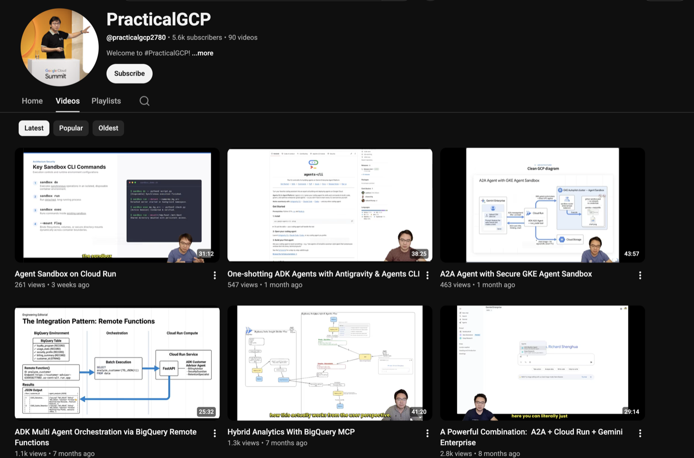

# Practical GCP — code examples

Code from the [**PracticalGCP** YouTube channel](https://www.youtube.com/@practicalgcp2780) —
90+ hands-on deep dives on Google Cloud: agents (ADK, A2A, Gemini Enterprise), BigQuery,
Pub/Sub, Cloud Run and Dataplex. Not slideware — the things that actually broke, and how they
were fixed.

[](https://www.youtube.com/@practicalgcp2780?sub_confirmation=1)
[](https://www.youtube.com/playlist?list=UU3XbEkSbPOzHvqNBrjNIu7A)

[](https://www.youtube.com/@practicalgcp2780/videos)

Most folders here accompany a video. Find your topic below, watch the walkthrough, then run
the code — each folder has its own README with setup steps.

## Agents (ADK / A2A / Gemini Enterprise)

| Folder | What it shows | Video |
|---|---|---|
| [`cloudrun-agent-sandbox`](./cloudrun-agent-sandbox) | Secure code interpreter on the native Cloud Run Sandbox | [▶ Agent Sandbox on Cloud Run](https://youtu.be/LgEcEPAa2iQ) |
| [`a2a-with-gke-sandbox`](./a2a-with-gke-sandbox) | A2A agent running untrusted LLM code in a GKE Agent Sandbox (gVisor) | [▶ A2A Agent with Secure GKE Agent Sandbox](https://youtu.be/4sLzV4rtZak) |
| [`build-with-agents-cli`](./build-with-agents-cli) | Scaffolding ADK agents with Antigravity + agents-cli | [▶ One-shotting ADK Agents](https://youtu.be/JZXOhsFakPk) |
| [`adk-a2a`](./adk-a2a) | A2A agent on Cloud Run, surfaced in Gemini Enterprise | [▶ A2A + Cloud Run + Gemini Enterprise](https://youtu.be/VBFYfKD-TPU) |
| [`bq-remote-function-agent`](./bq-remote-function-agent) | Multi-agent orchestration invoked as a BigQuery remote function | [▶ ADK Multi Agent Orchestration](https://youtu.be/HBRP08k1zPQ) |
| [`adk-dataplex-dq-agent`](./adk-dataplex-dq-agent) | ReAct agent that drives Dataplex data quality | [▶ A Powerful Data Quality Agent for Dataplex](https://youtu.be/ugPoYRX6QDc) |
| [`adk_agents`](./adk_agents) | ADK agents on Agent Engine (Conversational Analytics, part 2) | [▶ Conversational Analytics Agent Part 2](https://youtu.be/o6QXEYhKC78) |
| [`adk_agents_frontend`](./adk_agents_frontend) | Agent frontend on Cloud Run behind IAP (part 3) | [▶ Conversational Analytics Agent Part 3](https://youtu.be/IuUsEpEiY-E) |
| [`conv_analytics_api`](./conv_analytics_api) | Conversational Analytics API basics (part 1) | [▶ Conversational Analytics Agent Part 1](https://youtu.be/0cdVlGJk2NQ) |
| [`adk-agent-engine`](./adk-agent-engine) | Deploying an ADK agent with Agent Starter Pack | [▶ Deploy your ADK Agent in under 5 minutes](https://youtu.be/_PU0fNGIvUw) |
| [`adk-ae-oauth`](./adk-ae-oauth) | Agent Engine + OAuth 2.0, reading Drive as the end user | _no video yet_ |
| [`adk-agent-sandbox`](./adk-agent-sandbox) | Analyst harness: agent writes and validates BigQuery SQL | _no video yet_ |
| [`adk-agy-agent`](./adk-agy-agent) | ADK delegating to a managed agent via the Skill Registry | _no video yet_ |
| [`adk-agent-billing`](./adk-agent-billing) | Tracking agent token spend | _no video yet_ |
| [`local-recipe-planner`](./local-recipe-planner) | Minimal ReAct agent scaffolded by `agents-cli` | _no video yet_ |
| [`mcp-toolbox-4-databases`](./mcp-toolbox-4-databases) | MCP Toolbox for databases | _no video yet_ |
| [`claude-code-gateway-on-cloudrun`](./claude-code-gateway-on-cloudrun) | Private Claude gateway on Cloud Run + Cloud SQL, via Terraform | _no video yet_ |

## BigQuery & analytics

| Folder | What it shows | Video |
|---|---|---|
| [`bigquery-mcp`](./bigquery-mcp) | Hybrid analytics with the BigQuery MCP server | [▶ Hybrid Analytics With BigQuery MCP](https://youtu.be/1wvrKYHmJlw) |
| [`history_based_optimisation`](./history_based_optimisation) | Measuring the real impact of history-based optimisation | [▶ How effective is History-based Optimisation](https://youtu.be/vKP6C83lZN0) |
| [`continuous_queries_llm_customer_feedback`](./continuous_queries_llm_customer_feedback) | Continuous queries + Gemini for feedback categorisation | [▶ Use Continuous Query and LLM](https://youtu.be/AFYaUUotMdM) |
| [`analytics_hub_data_clean_room`](./analytics_hub_data_clean_room) | Data clean rooms on Analytics Hub | [▶ Centralised Data Sharing using Analytics Hub](https://youtu.be/9VF7DYk_Wug) |
| [`dataplex_yaml`](./dataplex_yaml) | Managing Dataplex DQ scans as YAML | [▶ Manage Data Quality at Scale with Dataplex](https://youtu.be/fLeh0TC9PfM) |
| [`dlt_examples`](./dlt_examples) | Running dlt pipelines for Slack & GitHub | _no video yet_ |

## Pub/Sub & pipelines

| Folder | What it shows | Video |
|---|---|---|
| [`pubsub_replay`](./pubsub_replay) | Replaying messages when things go wrong | [▶ Handle the unexpected by replaying messages](https://youtu.be/Y609YOg7tsg) |
| [`pubsub_producer_flowcontrol`](./pubsub_producer_flowcontrol) | Publisher flow control, and what BLOCK really does | [▶ Reliable and Controlled Cloud PubSub Producer](https://youtu.be/1ULFzixnWxo) |

## Cloud Run, LLM serving & the rest

| Folder | What it shows | Video |
|---|---|---|
| [`vllm-cloud-run`](./vllm-cloud-run) | DeepSeek R1 on Cloud Run with vLLM | [▶ Optimising Open Source LLM Deployment](https://youtu.be/zc0g2BoQ4zM) |
| [`tgi-cloud-run`](./tgi-cloud-run) | DeepSeek R1 on Cloud Run with Hugging Face TGI | [▶ Optimising Open Source LLM Deployment](https://youtu.be/zc0g2BoQ4zM) |
| [`ollama-cloud-run`](./ollama-cloud-run) | Ollama + DeepSeek on Cloud Run GPUs | [▶ When Cloud Run Meets Deepseek](https://youtu.be/7H6fJVf79o0) |
| [`mask-banana`](./mask-banana) | Mask-based in-painting with Nano Banana | [▶ Mask Banana](https://youtu.be/7YtG5ddx1Y8) |
| [`vertex-ai-virtual-try-on`](./vertex-ai-virtual-try-on) | Vertex AI Virtual Try-On API | [▶ Virtual Try-On with Vertex AI](https://youtu.be/VjDsJ2piXg8) |
| [`colab_enterprise_no_internet_setup`](./colab_enterprise_no_internet_setup) | pip installs in a no-internet Colab Enterprise | [▶ Secure Offline Package Management in Jupyter](https://youtu.be/WAgHzdiTBsk) |
| [`script-to-video-generator`](./script-to-video-generator) | Script → narrated 9:16 chalkboard video | _no video yet_ |

Older topics (Composer, Dataflow, Spanner CDC, IAP, Datastore, DLP and more) are covered on
the channel but predate this repo — browse the
[full video list](https://www.youtube.com/@practicalgcp2780/videos).

## Contributing / conventions

New example? Give the folder a README that starts with the video link:

```markdown
> 📺 **Watch:** [Video title](https://youtu.be/VIDEO_ID)
```

Then add one row to the table above. That's the whole process.

## Questions

Open an [issue](../../issues), or leave a comment on the video — questions in the comments
often become the next episode.
