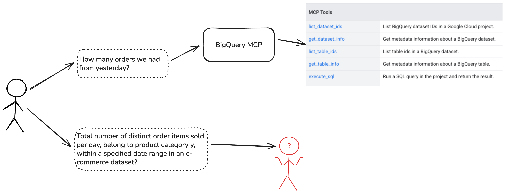
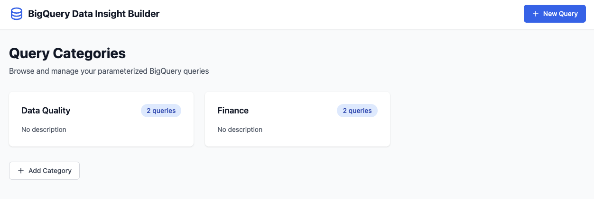
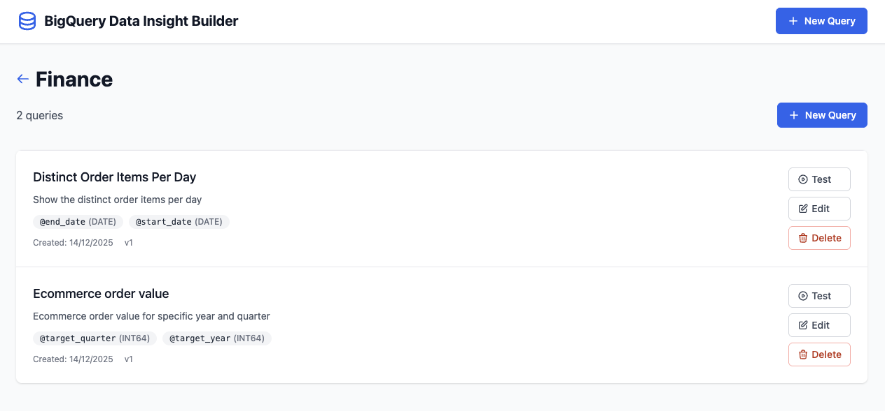
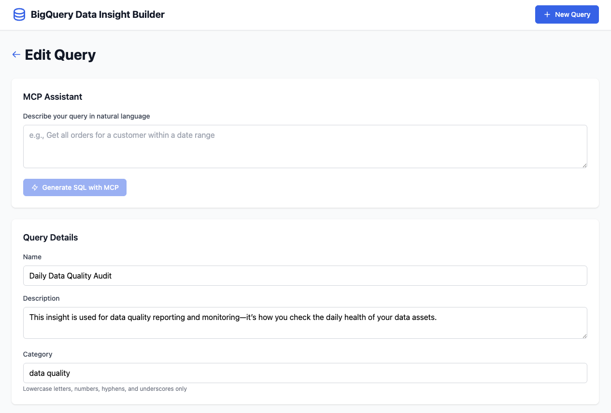
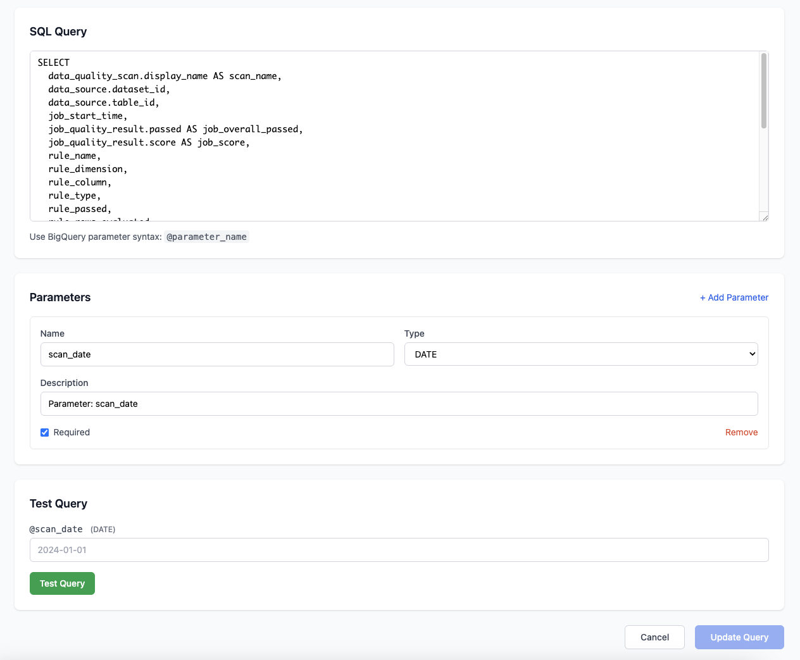
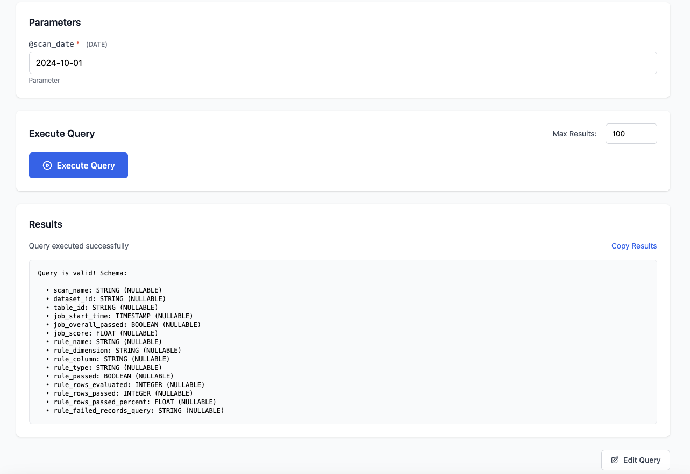

# BigQuery MCP Examples

Two complementary applications demonstrating BigQuery analytics workflows using MCP (Model Context Protocol).

## The Problem

When users interact with BigQuery using natural language queries, they often face challenges with query reliability and accuracy:



## Architecture

This solution addresses these challenges through a structured approach:


## Components

### [bigquery-data-insight-builder](./bigquery-data-insight-builder)
GUI application for creating, testing, and maintaining a curated library of parameterized SQL queries. Data analysts use this to build and validate production-ready queries with MCP assistance.

#### Overview


#### Category Management


#### Query Editing



#### Testing & Validation


### [bigquery-analytics-agent](./bigquery-analytics-agent)
Dual-mode analytics agent built with Google's ADK. Supports both ad-hoc query generation (Explore mode) and access to curated reports from the insight builder (Production mode).

## Setup

Env Vars
```
export REGION='us-central1'
export PROJECT_ID='rocketech-de-pgcp-sandbox'
```

### 1. Enable MCP on the Project

```bash
gcloud beta services mcp enable bigquery.googleapis.com \
    --project=${PROJECT_ID}
```

### 2. Create Cloud Datastore Database

Create a named Datastore database for storing query templates and categories:

```bash
# Create the "ai-agents" database

gcloud firestore databases create --database=ai-agents-db \
    --location=${REGION} \
    --type=datastore-mode \
    --project=${PROJECT_ID}
```

Visit the [Datastore console](https://console.cloud.google.com/datastore/setup) if you prefer to create it via the UI.

### 3. Grant Permissions

Grant the following roles to the appropriate users or service accounts:

- **Service Usage Admin** (`roles/serviceusage.serviceUsageAdmin`) - Enable APIs and MCP servers in the project
- **MCP Tool User** (`roles/mcp.toolUser`) - Make MCP tool calls
- **BigQuery Job User** (`roles/bigquery.jobUser`) - Run BigQuery jobs
- **BigQuery Data Viewer** (`roles/bigquery.dataViewer`) - Query BigQuery data

### 4. User Project Header

The Google user project header is required, especially when running locally:

```bash
--header "x-goog-user-project: <replace with your project id>"
```

## How They Work Together

1. **Build**: Use the insight builder to create and test parameterized queries
2. **Deploy**: Save approved queries to Cloud Datastore
3. **Consume**: Analytics agent accesses the curated query library in Production mode

## Userful to Read
- [BigQuery MCP Main Doc](https://docs.cloud.google.com/bigquery/docs/use-bigquery-mcp)
- [BigQuery MCP Tools Overview](https://docs.cloud.google.com/bigquery/docs/reference/mcp/tools_overview)
