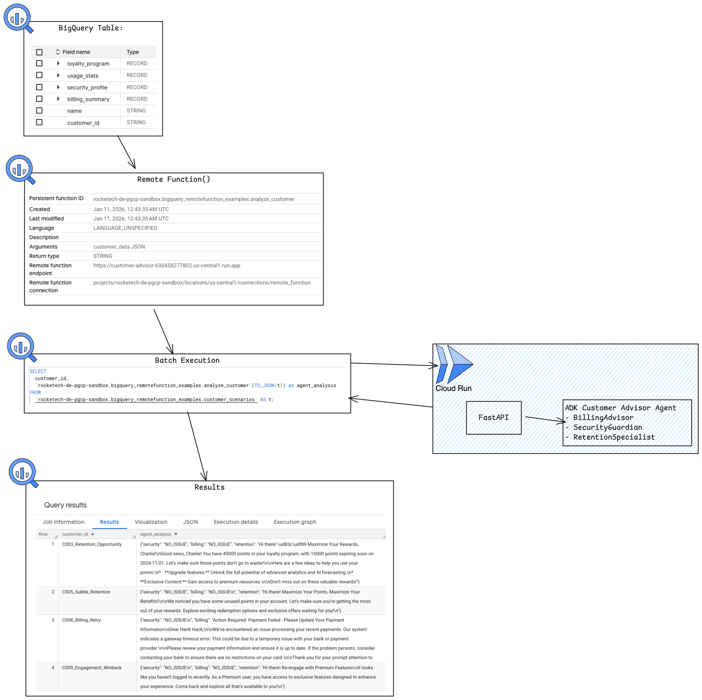

# BigQuery Remote Function Agent (ADK)



A scalable multi-agent system (Customer Advisor) built with Google's Agent Development Kit (ADK) designed to run as a BigQuery Remote Function (Cloud Run). It orchestrates specialized agents (Security, Billing, Retention) to analyze customer data in parallel.

## Project Structure

This project is organized as follows:

```
bq-remote-function-agent/
├── bq_import_data.py       # Script to load test data to BQ
└── customer-advisor              # ADK Customer Advisor Agent
    ├── app/
    │   ├── agent.py            # Multi-agent logic (ParallelAgent + Specialists)
    │   ├── fast_api_app.py     # BigQuery Remote Function Handler (FastAPI)
    │   └── app_utils/          # Telemetry and utilities
    ├── data/
    │   └── customer_scenarios.json # Test data for BigQuery simulation
    ├── tests/
    │   └── integration/
    │       └── test_bq_process.py  # End-to-end integration test
    ├── Makefile                # Build and deployment commands
    ├── Dockerfile              # Container definition for Cloud Run
    └── pyproject.toml          # Project dependencies (uv)
```

> 💡 **Tip:** Use [Gemini CLI](https://github.com/google-gemini/gemini-cli) for AI-assisted development - project context is pre-configured in `GEMINI.md`.

## BigQuery Remote Function Testing

We have included a comprehensive integration test that verifies the full end-to-end flow using 10 complex customer scenarios. This test validates the agent logic, session management, and response format.

**Run the automated test:**
```bash
uv run pytest tests/integration/test_bq_process.py
```

This test:
1.  Mimics the BigQuery Remote Function call independently.
2.  Sends the payload from `data/customer_scenarios.json`.
3.  Validates the agent's response for correctness (Security, Billing, Retention handling).

### Manual Local Testing (Uvicorn)

If you want to run the server and test it manually:

1. **Start the local server:**
```bash
uv run uvicorn app.fast_api_app:app --host 0.0.0.0 --port 8011
```

2. **Send test payload:**
In another terminal, run:
```bash
curl -X POST http://localhost:8011/ \
  -H "Content-Type: application/json" \
  -d @data/customer_scenarios.json | jq .
```

## Deploy to Cloud Run

You can deploy your agent to a Dev Environment using the following command:

```bash
gcloud config set project <your-dev-project-id>
make deploy
```

## BigQuery Setup & Remote Function

### 1. Import Test Data
Run the provided script to load the customer scenarios into BigQuery:
```bash
# Run from the bq-remote-function-agent folder
python3 bq_import_data.py
```
This script populates the `customer_scenarios` table in the `rocketech-de-pgcp-sandbox.bigquery_remotefunction_examples` dataset.

### 2. Create the Remote Function
After deploying the Cloud Run service, define the Remote Function in BigQuery:

1. **Create a Connection**: Set up a BigQuery Cloud Resource Connection in `us-central1`.
2. **Grant Permissions**: Assign the `Cloud Run Service Invoker` role to the connection's service account for your Cloud Run service.
3. **Define Function**:
```sql
CREATE OR REPLACE FUNCTION `rocketech-de-pgcp-sandbox.bigquery_remotefunction_examples.analyze_customer`(customer_data JSON) 
RETURNS STRING
REMOTE WITH CONNECTION `rocketech-de-pgcp-sandbox.us-central1.your-connection-id`
OPTIONS (
  endpoint = 'https://YOUR_CLOUD_RUN_URL/',
  max_batching_rows = 10
);
```

### 3. Run Analysis in SQL
Call the agent across your entire dataset directly via SQL:
```sql
SELECT 
  customer_id, 
  `rocketech-de-pgcp-sandbox.bigquery_remotefunction_examples.analyze_customer`(TO_JSON(t)) as agent_analysis
FROM 
  `rocketech-de-pgcp-sandbox.bigquery_remotefunction_examples.customer_scenarios` AS t;
```

## Trade-offs: ADK vs. Native Implementation

When choosing between using the **Agent Development Kit (ADK)** and building a native LLM integration, consider the following architectural trade-offs:

### 🚀 Pros of using ADK

1.  **Write Once, Use Anywhere**: Your agent logic is decoupled from the execution environment. You can call the same ADK agent from **Gemini Enterprise**, **BigQuery Remote Functions** (this solution), or an **Event-Driven architecture**. This significantly cuts down development time and flattens the learning curve.
2.  **Sophisticated Agent Design**: ADK provides a robust framework for complex behaviors, including **Multi-Agent orchestration (Sub-agents)**, **Tool calls (Function Calling)**, and built-in **Tracing/Monitoring**. This allows you to test and evaluate the agent independently from the "plumbing" of the hosting application.
3.  **Speed to Production**: Leveraging the **Agent Starter Pack** provides pre-configured boilerplates for **Vertex AI Agent Engine** or **Cloud Run**, dramatically speeding up the path from prototype to deployed service.

### ⚖️ Potential Challenges

1.  **Session Management Overhead**: ADK is inherently session-based. For stateless batch processing like BigQuery Remote Functions, managing these sessions can feel like unnecessary "state" (though we’ve optimized this with `InMemorySessionService` to prevent leaks).
2.  **Batching Complexity**: BigQuery thrives on batching, but ADK’s modular nature (especially when sub-agents use different models) makes standard batch inference more challenging. There are cost implications to consider if your workload requires extremely high-volume batch processing where raw Vertex AI Batch API might be more efficient.
