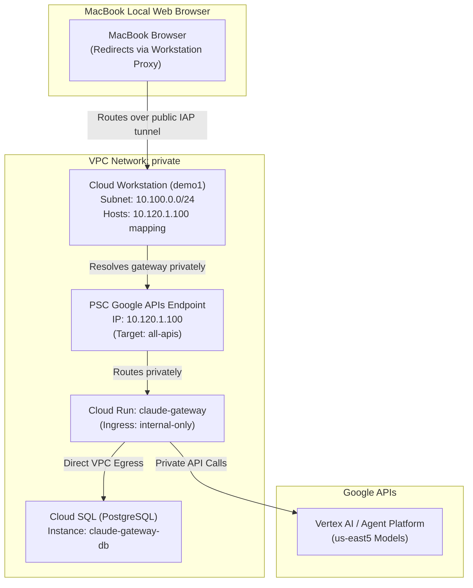

# Claude Apps Gateway on Cloud Run (Terraform Deployment)

This directory contains the Terraform configuration and instructions for deploying the **Claude Apps Gateway** privately on Google Cloud Run with internal-only ingress, backed by a private Cloud SQL (Postgres 16) instance, utilizing your existing VPC network and subnet.

---

## Architecture Overview



---

## Prerequisites

1. **Setup Gateway Configuration:**
   Copy the example gateway configuration file to the root of your directory:
   ```bash
   cp gateway.yaml.example gateway.yaml
   ```
   Open `gateway.yaml` and configure:
   - `client_id`: Your Google Workspace OAuth Client ID (from the Google Cloud Console).
   - `allowed_email_domains`: List of email domains allowed to access the gateway (e.g., `[yourcompany.com]`).
   - Under `upstreams`: Set your GCP `project_id` and the `region` where your Vertex AI partner model quota resides (e.g., `us-east5`).

2. **Obtain Google OAuth Client Secret:**
   Obtain the OIDC Client Secret (starts with `GOCSPX-`) for your Google OAuth client. To keep this secret secure, **never** write it into files in this directory.

---

## Deployment Steps

All infrastructure is provisioned from the [`terraform/`](file:///Users/rocketech/repos/practical-gcp-examples/claude-code-gateway-on-cloudrun/terraform) subdirectory.

### 1. Initialize and Create the Registry
Navigate to the Terraform folder and initialize the providers:
```bash
cd terraform
terraform init
```

Run a targeted apply to create the Artifact Registry repository first (required so we have somewhere to push the Docker container image):
```bash
terraform apply -target=google_artifact_registry_repository.repo
```

### 2. Build and Push the Container Image
From the root directory, build and push the container image containing the Bun-compiled gateway binary:
```bash
# 1. Download the public linux-x64 release binary of Claude Code (includes gateway CLI)
BASE="https://downloads.claude.ai/claude-code-releases"
VERSION="$(curl -fsSL --proto '=https' "${BASE}/latest")"
curl -fL --proto '=https' --proto-redir '=https' -o ../claude "${BASE}/${VERSION}/linux-x64/claude"
chmod +x ../claude

# 2. Configure Docker authentication for Artifact Registry in us-central1
gcloud auth configure-docker us-central1-docker.pkg.dev --quiet

# 3. Build and push the image to Artifact Registry
docker build --platform=linux/amd64 --provenance=false -f ../Dockerfile -t "us-central1-docker.pkg.dev/rocketech-de-pgcp-sandbox/claude-gateway/gateway:${VERSION}" ..
docker push "us-central1-docker.pkg.dev/rocketech-de-pgcp-sandbox/claude-gateway/gateway:${VERSION}"
```

### 3. Deploy the Gateway Stack (Full Apply)
Run the full Terraform apply. Pass in the Google OIDC Client Secret securely via shell environment variables to keep it out-of-band and out of the filesystem:
```bash
export TF_VAR_oidc_client_secret="GOCSPX-YOUR-SECRET-HERE"
terraform apply
```

This will automatically:
* Provision a private-IP Cloud SQL instance (`claude-gateway-db`) utilizing the cost-optimized **`db-g1-small`** tier on the `ENTERPRISE` edition.
* Mount your configuration (`gateway.yaml`) and database connection strings to Secret Manager.
* Deploy the Cloud Run service (`claude-gateway`) privately inside your `private` VPC network using `claude-gateway` subnet.

---

## Workstation Onboarding Configuration

Before starting, you must configure the `claude` CLI client inside the Cloud Workstation to use your custom gateway instead of the public Anthropic endpoint:

1. **Inside the Cloud Workstation**, create the managed settings directory and configuration file:
   ```bash
   sudo mkdir -p /etc/claude-code
   ```
2. **Write the settings file** directing the CLI to your gateway's URL:
   ```bash
   echo '{"forceLoginMethod": "gateway", "forceLoginGatewayUrl": "https://claude-gateway-630458277802.us-central1.run.app"}' | sudo tee /etc/claude-code/managed-settings.json
   ```
3. **Map the gateway domain to the private PSC IP address** in `/etc/hosts` (mandatory to bypass the Claude CLI client-side private network check):
   ```bash
   echo "10.120.1.100  claude-gateway-630458277802.us-central1.run.app" | sudo tee -a /etc/hosts
   ```

---

## How to authenticate (Corporate Network Simulation)

Since the Cloud Run service is strictly private (`ingress=internal`), Google OIDC redirects back to the private domain `https://claude-gateway-630458277802.us-central1.run.app/oauth/callback` at the end of the sign-in flow. 

In a production environment, this is resolved by corporate VPN/DNS routing. To **simulate the corporate network locally on your MacBook** without needing a VPN configuration, follow these steps:

### 1. Configure your local MacBook (Client)
Run these commands in your **local MacBook terminal** (not inside the workstation):

*   **Install `socat` on your MacBook** (requires Homebrew):
    ```bash
    brew install socat
    ```
*   **Alias the private PSC IP** to your local loopback interface:
    ```bash
    sudo ifconfig lo0 alias 10.120.1.100
    ```
*   **Update your MacBook's `/etc/hosts` file** to map the domain to this private IP:
    ```text
    # Add to /etc/hosts on your MacBook:
    10.120.1.100  claude-gateway-630458277802.us-central1.run.app
    ```
*   **Start the workstation TCP port forwarder** (mapping your local port 8080 to the workstation's port 8080):
    ```bash
    gcloud workstations start-tcp-tunnel demo1 8080 \
      --cluster=practical-gcp-workstation \
      --config=config-mrpcdu4o \
      --region=us-central1 \
      --project=rocketech-de-pgcp-sandbox \
      --local-host-port=localhost:8080
    ```
    *(Keep this command running).*
*   **Bridge the local private IP to the workstation tunnel** on port 443 (run in a separate MacBook terminal):
    ```bash
    sudo socat TCP-LISTEN:443,bind=10.120.1.100,fork,reuseaddr TCP:127.0.0.1:8080
    ```
    *(Keep this command running).*

### 2. Configure the Cloud Workstation (Server)
Inside your **Cloud Workstation terminal**, start the final tunnel bridge forwarding port 8080 to Cloud Run:
```bash
# Install socat if it is missing
sudo apt-get update && sudo apt-get install -y socat

# Start the background forwarder
socat TCP-LISTEN:8080,fork,reuseaddr TCP:claude-gateway-630458277802.us-central1.run.app:443
```
*(Keep this command running).*

### 3. Log in!
1. Inside the workstation terminal, run `claude` (or trigger `/login`). It will print the verification link:
   `https://claude-gateway-630458277802.us-central1.run.app/device?user_code=ABCD-EFGH`
2. Open this link directly in your MacBook's browser. It will load natively (resolving to your local loopback alias), verify your code, and redirect you to Google Workspace Login.
3. Authenticate with Google. Google will redirect your browser back to the callback page:
   `https://claude-gateway-630458277802.us-central1.run.app/oauth/callback?code=...`

Because of your local loopback alias and tunnels, the browser completes this redirect natively and automatically, logging you in instantly without any manual URL modifications!

---

## Troubleshooting

### "Couldn't load settings from Cloud gateway" on Startup
If you rebuild the database (e.g., by running `terraform destroy` and `terraform apply`), your workstation's locally cached OIDC session tokens will become invalid, causing `claude` to fail on startup.

To resolve this, run this command in your Cloud Workstation terminal to clear the cached sessions:
```bash
rm -f ~/.claude/.credentials.json
```
Once cleared, running `claude` will boot successfully as unauthenticated and prompt you to run the login workflow.

---

## Teardown (Clean-up)

To delete all the deployed resources and avoid incurring any GCP costs:

1. Update your variables or `terraform.tfvars` file to disable database deletion protection:
   ```tf
   deletion_protection = false
   ```
2. Run `terraform apply` to apply the deletion protection status.
3. Run `terraform destroy` to cleanly tear down the entire stack.
