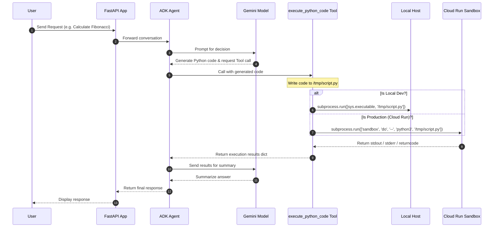

# Cloud Run Agent Sandbox - Secure Code Interpreter

A secure Python Code Interpreter agent developed with the Google Agent Development Kit (ADK) and deployed to Cloud Run using the native **Cloud Run Sandbox** launcher for isolated, zero-trust execution of dynamic AI-generated scripts.

---

## 1. Solution Design

### The Problem
AI agents designed for data analysis, complex math, or file processing frequently generate and execute Python code dynamically. Running arbitrary, untrusted LLM-generated code on a host application container creates severe security vulnerabilities:
- Exposure of GCP Service Account credentials via the metadata server.
- Potential compromise of host environment variables and secrets.
- Unauthorized access to internal VPC networks or databases.

### The Solution: Cloud Run Sandboxes
This project implements a secure sandbox execution pattern utilizing Google Cloud's **Cloud Run Sandbox** feature (available in public preview). 
- **Isolation by Default:** Subprocesses run inside a zero-trust sandbox that has no access to the host container's environment variables, secrets, or GCP Metadata server.
- **Egress Restriction:** Network access is blocked by default, protecting internal services. Outbound access can be selectively enabled for specific tasks.
- **System-Independent Fallback:** To support a seamless developer experience (TDD), the system automatically detects if the `sandbox` utility is available. If missing (local development/testing), it falls back to standard execution with a warning. In production, it enforces strict sandbox requirements.

---

## 2. Architecture

### Execution Flow



### Security Boundaries
- **Egress Isolation:** The sandbox blocks all outbound requests unless deployed with `--sandbox-launcher` and executed using `sandbox do --allow-egress`.
- **Credential Protection:** Any attempt to request `http://metadata.google.internal` inside the sandbox fails with a connection error.
- **Ephemeral Filesystem:** Writes are written to an ephemeral memory overlay discarded immediately upon process termination.

---

## 3. Code Breakdown and Repository Knowledge Graph

### File Structure & Roles
- **`app/tools.py`**: Defines the `execute_python_code` tool. Checkpoints the current environment (via `os.environ["K_SERVICE"]`), isolates execution, manages the local Python path via `sys.executable`, and catches timeouts cleanly.
- **`app/agent.py`**: Declares the `root_agent` configuration, instructions, and maps weather, time, and python sandbox tools.
- **`tests/unit/test_tools.py`**: Standard PEP-8 unit tests validating sandbox execution, local fallback, production sandbox requirements, and timeout behaviors.
- **`tests/integration/test_sandbox_agent.py`**: Validates agent configuration and tool registration.
- **`deploy.sh`**: Command-line deployment wrapper using the Google Cloud SDK.

### Repo Knowledge Graph


---

## 4. How to Run & Deploy

### Local Installation
1. Ensure `uv` and the Google Cloud SDK are installed on your machine.
2. Install project dependencies:
   ```bash
   agents-cli install
   ```

### Running Local Tests
Unit and integration tests run system-independently by mocking environment details:
```bash
uv run --env-file .env pytest
```

### Interactive Local Testing (Playground)
Launch the local ADK developer playground to interact with the agent:
```bash
agents-cli playground
```

### Deployment to Cloud Run
To deploy the agent to Cloud Run with the **Cloud Run Sandbox** launcher enabled, use the deployment wrapper:
```bash
chmod +x deploy.sh
./deploy.sh
```

---

## 5. Agent Sandbox Challenge: Stateful Data Processing Pipeline

To test the agent's full capabilities (isolated execution, background daemons, snapshotting, and persistent bind mounting), you can present the agent with the following multi-turn challenge. 

This challenge tasks the agent with building a background data processor that reads raw inputs from the host container, computes outputs inside a background sandbox, writes them directly back to the GCS FUSE bucket via a security-scoped bind mount, and exports a snapshot of the worker.

### Phase 1: Host Data Preparation
*   **Prompt:** `Create a directory named 'pipeline' in our session folder and write a CSV file named 'raw_inputs.csv' containing five numbers: 10, 20, 30, 40, 50 (one per line).`
*   **Tool call (`execute_python_code`):**
    ```python
    execute_python_code(
        code="""import os
path = '/sessions/{session_id}/pipeline'
os.makedirs(path, exist_ok=True)
with open(f'{path}/raw_inputs.csv', 'w') as f:
    f.write('10\\n20\\n30\\n40\\n50\\n')
"""
    )
    ```

### Phase 2: Start Background Worker with Bind Mount
*   **Prompt:** `Create a python worker script inside our 'pipeline' directory that reads 'raw_inputs.csv', multiplies each number by 10, and writes the results to 'processed_outputs.csv', then sleeps for 1 hour. Start a background detached sandbox named 'pipeline-worker' running this script, mapping our 'pipeline' directory to '/mnt/data' in the sandbox.`
*   **Tool calls (`execute_python_code` & `execute_sandbox_command`):**
    *   **Write the script:**
        ```python
        execute_python_code(
            code="""with open('/sessions/{session_id}/pipeline/worker.py', 'w') as f:
    f.write('''import time
with open("/mnt/data/raw_inputs.csv", "r") as f_in:
    nums = [int(line.strip()) for line in f_in if line.strip()]
processed = [str(n * 10) for n in nums]
with open("/mnt/data/processed_outputs.csv", "w") as f_out:
    f_out.write("\\n".join(processed) + "\\n")
time.sleep(3600)
''')"""
        )
        ```
    *   **Start the background sandbox:**
        ```python
        execute_sandbox_command(
            command=["python3", "/mnt/data/worker.py"],
            detach=True,
            sandbox_name="pipeline-worker",
            write=True,
            mounts=["type=bind,source=/sessions/{session_id}/pipeline,destination=/mnt/data"]
        )
        ```

### Phase 3: Monitor & Verify the Pipeline Output
*   **Prompt:** `Verify the pipeline results. Check if '/mnt/data/processed_outputs.csv' exists inside the sandbox, and verify its final content by printing the file from the host's pipeline directory.`
*   **Tool calls:**
    *   **Check inside the sandbox:**
        ```python
        execute_sandbox_command(
            command=["ls", "-la", "/mnt/data/processed_outputs.csv"],
            exec_on_sandbox="pipeline-worker"
        )
        ```
    *   **Read host file (GCS FUSE):**
        ```python
        execute_python_code(
            code="with open('/sessions/{session_id}/pipeline/processed_outputs.csv') as f: print(f.read())"
        )
        ```

### Phase 4: Snapshot and Shutdown
*   **Prompt:** `Create a filesystem tar snapshot of the 'pipeline-worker' sandbox and save it as 'worker_snapshot.tar' inside our session's pipeline directory.`
*   **Tool call (`execute_sandbox_command`):**
    ```python
    execute_sandbox_command(
        tar_sandbox="pipeline-worker",
        tar_file="/sessions/{session_id}/pipeline/worker_snapshot.tar"
    )
    ```

---

## 6. Gotchas

- **Local Execution Security:** When running the agent locally during development, the tool runs code on the developer's host machine. Ensure you do not pass untrusted scripts locally.
- **Production Isolation Check:** If you deploy this service to Cloud Run without the `--sandbox-launcher` flag, the application will detect the production environment (`K_SERVICE` env var) and fail execution immediately to prevent Remote Code Execution (RCE) on the main container.
- **Outbound Network:** By default, scripts cannot access external APIs. If network access is required, the agent must set `allow_network=True` to instruct the sandbox utility to append the `--allow-egress` flag.
