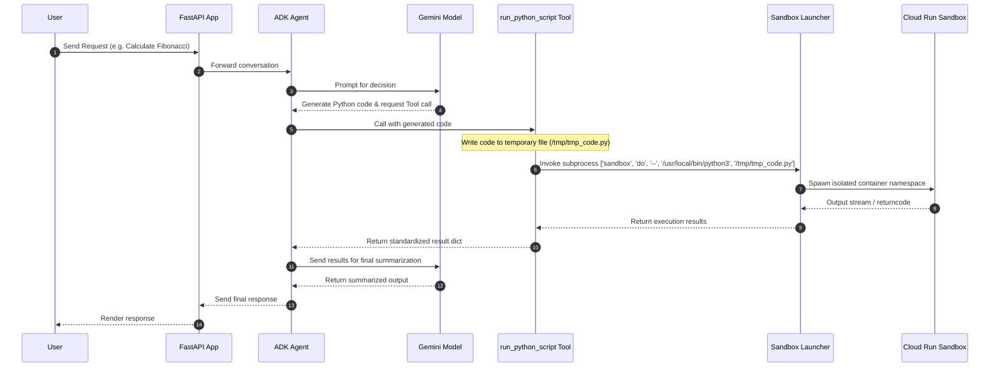
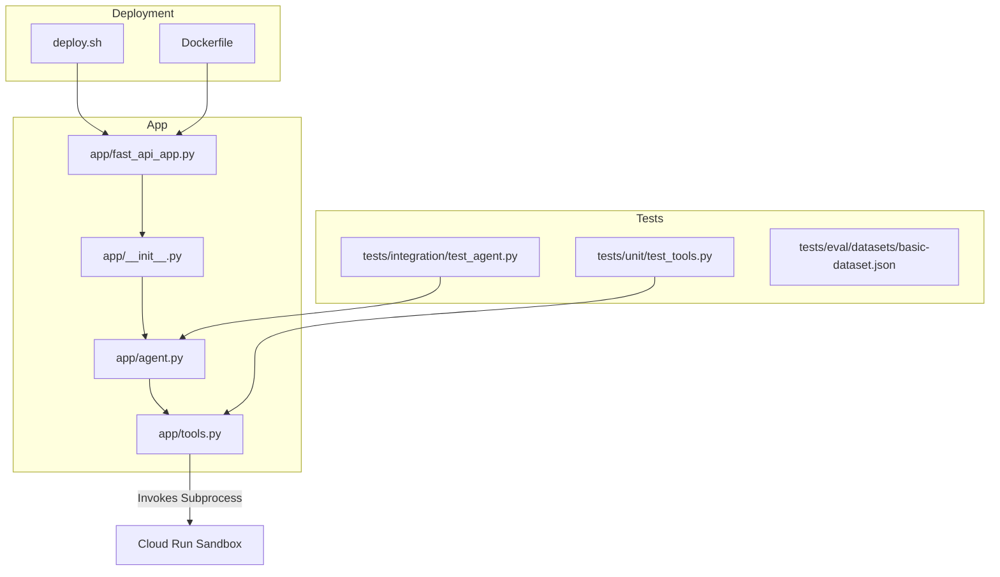

# Cloud Run Agent Sandbox - Secure Code Interpreter

A secure Python Code Interpreter agent developed with the Google Agent Development Kit (ADK) and deployed to Cloud Run using the native **Cloud Run Sandbox** launcher for isolated, zero-trust execution of dynamic AI-generated scripts.

---

## 1. Solution Design

### The Problem
AI agents designed for data analysis, complex math, or file processing frequently generate and execute Python code dynamically. Running arbitrary, untrusted LLM-generated code on a host application container creates severe security vulnerabilities:
- Exposure of GCP Service Account credentials via the metadata server.
- Potential compromise of host environment variables and secrets.
- Unauthorized access to internal VPC networks or databases.

### The Solution: Cloud Run Sandboxes
This project implements a secure sandbox execution pattern utilizing Google Cloud's **Cloud Run Sandbox** feature.
- **Isolation by Default:** Subprocesses run inside a zero-trust sandbox that has no access to the host container's environment variables, secrets, or GCP Metadata server.
- **Forced Egress Isolation:** Network access is blocked unconditionally, protecting internal services and preventing data exfiltration.
- **Exclusive Sandbox Targeting:** All local execution fallback simulation code has been removed. The tools now target Cloud Run Sandbox execution exclusively via the `sandbox` binary, throwing a `FileNotFoundError` if the utility is not found on the path or standard locations.

---

## 2. Architecture

### Execution Flow



### Security Boundaries
- **Forced Egress Isolation:** The sandbox blocks all outbound network requests unconditionally. To prevent data exfiltration, the backend hardcodes network access to disabled and blocks egress traffic entirely.
- **Credential Protection:** Any attempt to request `http://metadata.google.internal` inside the sandbox fails with a connection error.
- **Ephemeral Filesystem:** Writes are written to an ephemeral memory overlay discarded immediately upon process termination. To save files permanently, write them to `/mnt/persistent/`.
- **Session-Based Security Scoping:** Every user session is dynamically scoped. The backend automatically restricts persistent files and execution overlays to the active session folder (`/sessions/{session_id}/`). Directory traversal attempts to escape session boundaries are strictly denied, preventing cross-tenant or host-level access.

---

## 3. Code Breakdown and Repository Knowledge Graph

### File Structure & Roles
- **`app/tools.py`**: Defines the 5 granular Unix-style sandbox tools, private helper functions for resolving session directories, and resolving the sandbox binary path.
- **`app/agent.py`**: Declares the `root_agent` configuration, instructions, and registers the 5 granular sandbox tools, handling dynamic session scoping via callbacks.
- **`tests/unit/test_tools.py`**: Standard PEP-8 unit tests validating sandbox command construction, session directory scoping, and environment handling under mocked sandbox execution.
- **`tests/integration/test_agent.py`**: Validates agent configuration and tool registration.
- **`deploy.sh`**: Command-line deployment wrapper using the Google Cloud SDK.

### Repo Knowledge Graph



---

## 4. The 5 Granular Sandbox Tools

The legacy monolithic execution tools have been refactored into five clean, Unix-style tools designed for secure execution management inside the sandbox:

| Tool Name | Parameters | Description |
|-----------|------------|-------------|
| `run_python_script` | `code`, `write`, `sync_tar`, `env` | Runs a Python script block inside the sandbox ephemeral filesystem. |
| `run_sandbox_command` | `command`, `write`, `sync_tar`, `env` | Synchronously executes an arbitrary CLI command/process within a `sandbox do` container. |
| `start_background_sandbox` | `sandbox_name`, `command`, `write`, `env` | Starts a detached background sandbox session running a persistent command. |
| `execute_in_background_sandbox` | `sandbox_name`, `command` | Runs a command inside a previously started background sandbox using `sandbox exec`. |
| `stop_background_sandbox` | `sandbox_name` | Stops and deletes an active background sandbox session using `sandbox delete`. |

---

## 5. How to Run & Deploy

### Deployment to Cloud Run
To deploy the agent application to Cloud Run with the **Cloud Run Sandbox** launcher and isolated configuration, execute the deployment helper:
```bash
chmod +x deploy.sh
./deploy.sh
```

### Running the Agent
Once deployed, query the remote agent service using `agents-cli run` by pointing to its deployed Cloud Run URL:
```bash
agents-cli run --url https://<your-cloud-run-url> --mode adk "Compute the first 10 Fibonacci numbers."
```

---

## 6. Session Viewer (Streamlit GUI)

This project includes a local **Streamlit GUI** session viewer located under [tools/session-viewer/](tools/session-viewer/) to inspect historical agent execution logs, timelines, and LLM call-by-call telemetry from BigQuery without writing SQL queries.

### Setup & Launch
1. Ensure your Google SDK application default credentials are configured:
   ```bash
   gcloud auth application-default login
   ```
2. Run the Streamlit application local server:
   ```bash
   cd tools/session-viewer
   uv run streamlit run app.py
   ```
3. Open `http://localhost:8501` in your browser. Overrides for project settings or session lookups can be customized in the sidebar config or via environment variables (e.g. `BQ_DATASET`).

---

### 7. Technical Demo Scenarios

These 4 scenarios showcase the secure agent capabilities in action, mapping directly to the tool calls generated during the technical showcase demo:

### Scenario 1: Code Isolation & Internet Egress Blocking
*   **Goal**: Demonstrate that untrusted code runs in a zero-trust namespace with outbound internet access blocked by default.
*   **Demo Flow**:
    1.  **Local computation succeeds:**
        *   *User:* "Compute the first 10 Fibonacci numbers."
        *   *Agent Tool Call:*
            ```python
            run_python_script(code="def fib(n): ...; print(fib(10))")
            ```
        *   *Output:* Succeeds.
    2.  **Internet access is blocked:**
        *   *User:* "Download the google.com homepage and print its length."
        *   *Agent Tool Call:*
            ```python
            run_python_script(code="import urllib.request; urllib.request.urlopen('https://www.google.com')")
            ```
        *   *Output:* Returns a DNS lookup failure (`Temporary failure in name resolution`), proving the security egress block is active.

### Scenario 2: Session State Persistence (Sync Tar)
*   **Goal**: Demonstrate state preservation across separate ephemeral sandbox invocations using state tarball imports/exports.
*   **Demo Flow**:
    1.  **Write and export state:**
        *   *User:* "Write 5 customer names to `customers.csv` inside the sandbox and export our state as `state.tar`."
        *   *Agent Tool Call:*
            ```python
            run_python_script(
                code="with open('customers.csv', 'w') as f: ...",
                write=True,
                sync_tar="state.tar"
            )
            ```
    2.  **Import state and read:**
        *   *User:* "Read the customer CSV file we created in the previous step and print the names in uppercase."
        *   *Agent Tool Call:*
            ```python
            run_python_script(
                code="with open('customers.csv', 'r') as f: ...",
                write=True,
                sync_tar="state.tar"
            )
            ```

### Scenario 3: Persistent Background Services (Run & Exec)
*   **Goal**: Demonstrate starting a background container daemon and executing interactive commands inside its active namespace.
*   **Demo Flow**:
    1.  **Start daemon in background:**
        *   *User:* "Start a background web server named `web-server` on port 8000."
        *   *Agent Tool Call:*
            ```python
            start_background_sandbox(
                sandbox_name="web-server",
                command=["/usr/local/bin/python3", "-m", "http.server", "8000"],
                write=True
            )
            ```
    2.  **Execute command inside the server:**
        *   *User:* "Query our background web-server to verify it is running."
        *   *Agent Tool Call:*
            ```python
            execute_in_background_sandbox(
                sandbox_name="web-server",
                command=["/usr/local/bin/python3", "-c", "import urllib.request; print(urllib.request.urlopen('http://localhost:8000').status)"]
            )
            ```

### Scenario 4: Persistent Session Storage
*   **Goal**: Demonstrate secure, persistent storage that automatically spans separate sandbox containers and execution tools (both Python scripts and CLI commands) inside the active session.
*   **Demo Flow**:
    1.  **Write to persistent directory via Python:**
        *   *User:* "Write a file to my persistent folder with text 'Hello Host' using Python."
        *   *Agent Tool Call:*
            ```python
            run_python_script(
                code="with open('/mnt/persistent/proof.txt', 'w') as f:\n    f.write('Hello Host')",
                write=True
            )
            ```
        *   *Result:* Writes directly to `/mnt/persistent/proof.txt` (which the host dynamically maps to `/sessions/{session_id}/persistent/`).
    2.  **Verify persistence in a new sandbox via CLI:**
        *   *User:* "Start a new sandbox and read the file content from the persistent directory using cat."
        *   *Agent Tool Call:*
            ```python
            run_sandbox_command(
                command=["cat", "/mnt/persistent/proof.txt"]
            )
            ```
        *   *Result:* Displays `'Hello Host'`, verifying files are preserved and accessible across separate sandbox lifecycles and different tools in the same session.

---

## 8. Gotchas

- **Exclusive Sandbox Execution:** All fallback execution logic has been removed. Execution targets the Cloud Run Sandbox environment exclusively, requiring the native `sandbox` utility binary to be present (throwing a `FileNotFoundError` otherwise). Ensure tests use mocks/patches when running on machines without the `sandbox` utility.
- **Session Scoping Validation:** To protect against directory traversal, path validation restricts all state tar output destinations (`sync_tar`) to the active session directory (e.g., `/sessions/{session_id}`).
- **Forced Egress Block:** Outbound network calls inside the sandbox are blocked unconditionally. All network parameter overrides are ignored by the backend, ensuring a secure environment against exfiltration.
