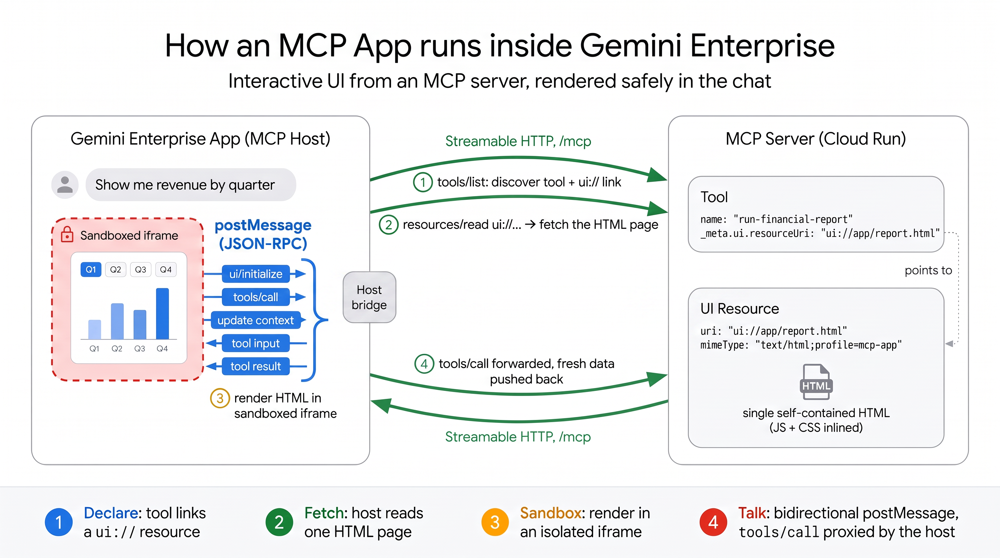

# MCP Apps for Gemini Enterprise

A collection of [MCP Apps](https://modelcontextprotocol.io/extensions/apps/build) —
MCP servers that ship an interactive HTML **UI resource** alongside their tools —
built and deployed to run inside **Gemini Enterprise** (Google Cloud Agent
Builder / Discovery Engine) on Cloud Run.



Each example is a self-contained app in its own subfolder. This top-level README
covers everything generic: how an MCP App is put together, prerequisites, and the
end-to-end recipe for hosting on Cloud Run and connecting to Gemini Enterprise.
Per-example specifics (service names, tool names, deploy values) live in each
example's own README.

## Examples

| Example | What it shows |
|---------|---------------|
| [`color-picker/`](color-picker/) | The minimal app: one tool (`pick-color`) + a native color-picker UI. Start here. |
| [`bigquery-financial-reports/`](bigquery-financial-reports/) | A read-only BigQuery reporting dashboard: parameterized SQL, Chart.js charts, top-N / period-over-period, CSV export — querying **as the signed-in user** via forwarded OAuth. Shows user-identity passthrough and database access. |
| [`legal-pdf-review/`](legal-pdf-review/) | Upload a PDF, let an LLM find the relevant clause, review it **highlighted on the rendered page**, validate, and summarize back into the chat. Shows file upload to per-user Cloud Storage, Vertex AI Gemini, and server-side PDF rendering (TypeScript + Python/PyMuPDF). |

_More examples to come — each will be added as a new subfolder with its own README._

## How an MCP App works

An MCP App is a normal MCP server plus a UI:

- A **tool** the host calls (e.g. `pick-color`), declared with input/output
  schemas.
- A **UI resource** served under a `ui://` URI as
  `text/html;profile=mcp-app`, linked from the tool via `_meta.ui.resourceUri`.
- The host runs the tool, then renders the returned UI in a **sandboxed
  iframe**. The UI talks back to the model with `app.sendMessage`.

The UI is bundled into a **single self-contained HTML file** (via
`vite-plugin-singlefile`) so there are no external asset requests at runtime —
which matters for the strict iframe CSP hosts apply (see the CSP note below).

Servers here expose **Streamable HTTP** (`POST /mcp`) by default for remote
hosting, with a stdio transport for local use. The fastest way to scaffold a new
one is the [`create-mcp-app`](https://github.com/modelcontextprotocol/ext-apps)
tooling; use [`color-picker/`](color-picker/) as a working reference.

## Prerequisites

- A GCP project with **Cloud Run** and **Agent Builder (Discovery Engine)**
  enabled; `gcloud` authenticated to that project.
- Node.js 22+ and `npm` for local development.
- **The Org Policy constraint `constraints/discoveryengine.managed.disableCustomMcpServerConnector`
  must NOT be enforced** on the project (or any parent folder/org). While it is
  enforced, creating the Custom MCP Server data store fails with
  `Operation denied by org policy ... disableCustomMcpServerConnector`, no matter
  how the server is deployed. Relaxing it is a governance change that requires an
  **Organization Policy Administrator** (`roles/orgpolicy.policyAdmin`), since
  this `*.managed.*` constraint is typically set at the org/folder level. To
  override it at the project level (if your org allows overrides):

  ```bash
  gcloud services enable orgpolicy.googleapis.com --project <PROJECT_ID>

  # JSON avoids the YAML-indentation pitfall (rules must nest under spec).
  cat > policy.json <<'EOF'
  {
    "name": "projects/<PROJECT_NUMBER>/policies/discoveryengine.managed.disableCustomMcpServerConnector",
    "spec": { "rules": [ { "enforce": false } ] }
  }
  EOF

  gcloud org-policies set-policy policy.json --project <PROJECT_ID>
  ```

  If the constraint is pinned higher up with no project override allowed, an
  admin must relax it at that level instead.

## Testing a server locally

Run any example's server (`npm run serve`), then point the `ext-apps` reference
host at it:

```bash
git clone https://github.com/modelcontextprotocol/ext-apps.git
cd ext-apps/examples/basic-host && npm install
SERVERS='["http://localhost:3001/mcp"]' npm start   # open http://localhost:8080
```

Or expose the local server to a cloud host (e.g. Claude) with a tunnel:
`npx cloudflared tunnel --url http://localhost:3001`.

## Deploying to Gemini Enterprise (Google Cloud) via Cloud Run

Gemini Enterprise renders interactive MCP App UIs inside a sandboxed iframe and
reaches the MCP server as a public **HTTPS Streamable-HTTP endpoint**, so the
server is hosted on Cloud Run. **No auth code is needed in the server** —
authorization is handled by two independent layers set up below:

1. **Service-to-service** — Gemini's Discovery Engine service agent invokes the
   private Cloud Run service (Step 2).
2. **User identity** — an OAuth client authorizes the end user against Google
   and forwards their token to the server (Step 3), so tools can act as the user.

The steps below are the same for every example; substitute the example's own
service name, tool name, and description (see its README).

> **CSP note:** GE's iframe forbids `unsafe-eval` and Web Workers/`blob:` URLs.
> Keep UIs eval-free and inline all assets (the single-file bundle does this).
> Plain DOM, native inputs, and canvas/SVG libs like Chart.js or Leaflet are
> fine; anything that calls `eval`/`new Function` or spawns a worker is not.

### Step 1 — Deploy to Cloud Run (private)

Each example ships a `Dockerfile` that `--source` auto-detects. Deploy from the
example's folder and keep the service private:

```bash
gcloud run deploy <service-name> \
  --source . \
  --region us-central1 \
  --no-allow-unauthenticated
```

Note the service URL and append `/mcp`:
`https://<service-name>-xxxxx.us-central1.run.app/mcp`.

### Step 2 — Grant invoker access to the Discovery Engine service agent

GE invokes the server as the project's Discovery Engine service agent.

```bash
gcloud run services add-iam-policy-binding <service-name> \
  --member="serviceAccount:service-<PROJECT_NUMBER>@gcp-sa-discoveryengine.iam.gserviceaccount.com" \
  --role="roles/run.invoker" \
  --region=us-central1
```

### Step 3 — Create an OAuth client (user authorization)

In **Google Cloud Console → APIs & Services → Credentials**, create an **OAuth
client ID** (Application type: **Web application**). Add the authorized redirect
URI:

```
https://vertexaisearch.cloud.google.com/oauth-redirect
```

Copy the **Client ID** and **Client Secret**.

### Step 4 — Connect the MCP data store in Gemini Enterprise

In **Agent Builder (Discovery Engine) → Data Stores → Create Data Store →
Custom MCP Server**, fill in:

| Field | Value |
|-------|-------|
| MCP Server URL | your Cloud Run `/mcp` URL |
| Authorization URL | `https://accounts.google.com/o/oauth2/auth` |
| Authorization URL Parameters | `&access_type=offline` (allows automatic token refresh) |
| Token URL | `https://oauth2.googleapis.com/token` |
| Client ID & Secret | from Step 3 |
| Scopes | `openid email profile https://www.googleapis.com/auth/cloud-platform` |
| Enable PKCE Support | Enabled |

Click **Login**, complete the Google auth prompt, then provide a **Description**
and **Instructions** telling the model when to call the example's tool (see the
example's README for suggested text). Click **Create**.

### Step 5 — Enable interactive actions

Open the data store, wait for status **Active**, go to the **Actions** tab, click
**Reload custom actions**, select the example's tool, and click **Enable
actions**. Gemini now invokes the tool and renders the widget directly in chat.

### Optional hardening

The server logs a DNS-rebinding warning on startup. Once you know the Cloud Run
hostname, pass `allowedHosts: ["<your>.run.app"]` to
`NodeStreamableHTTPServerTransport` in `main.ts` to restrict accepted `Host`
headers.

## References

- [Build an MCP App](https://modelcontextprotocol.io/extensions/apps/build)
- [MCP Apps SDK API docs](https://apps.extensions.modelcontextprotocol.io/api/)
- [ext-apps repository & examples](https://github.com/modelcontextprotocol/ext-apps)
