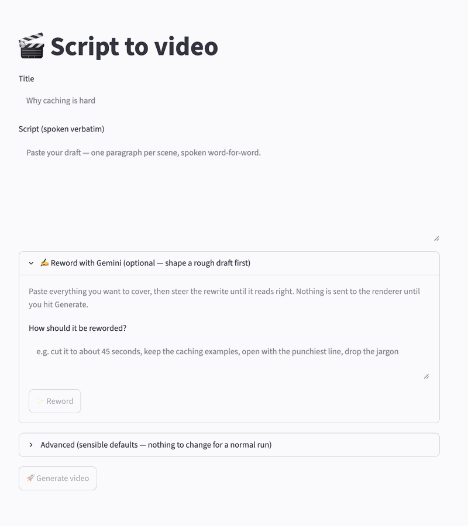
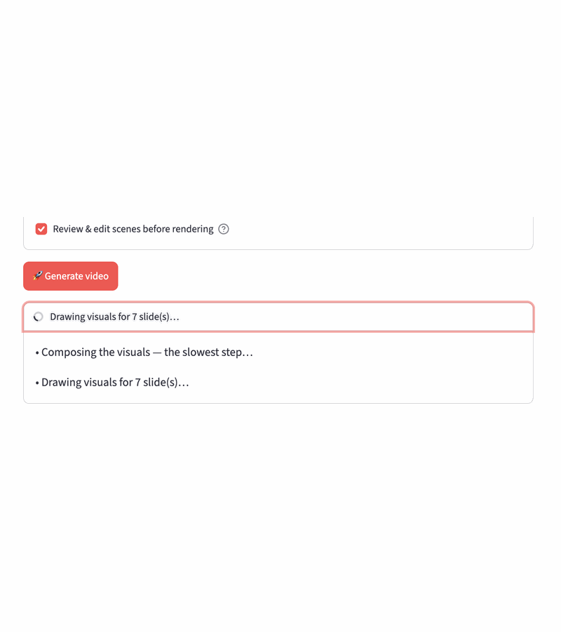

# Script to Video Generator 🎬

[](https://www.youtube.com/@practicalgcp2780?sub_confirmation=1)
[](https://www.youtube.com/playlist?list=UU3XbEkSbPOzHvqNBrjNIu7A)

_Code from the [PracticalGCP](https://www.youtube.com/@practicalgcp2780) YouTube channel._


Give it your script; get back a 9:16 hand-drawn "chalkboard" video with a
voiceover. Your words are narrated **verbatim** — nothing rewrites, shortens, or
fact-checks them. The LLM's only job is to *draw*: it authors bespoke Rough.js
visualization code per paragraph, which is statically safety-vetted before it
ever runs, and every element is pinned to a spoken cue phrase so the drawing
stays locked to the voice.

Here's a real one — a script about graph-based agents for ADK, start to finish:

[](https://github.com/richardhe-fundamenta/practical-gcp-examples/raw/main/script-to-video-generator/docs/example-graph-agent.mp4)

*First 10 seconds, silent loop — [play the full 94s with audio](https://github.com/richardhe-fundamenta/practical-gcp-examples/raw/main/script-to-video-generator/docs/example-graph-agent.mp4).*


---

## Contents

- [Quick start](#quick-start) — [CLI](#cli) · [Web UI](#web-ui) · [Tests](#tests)
- [Architecture](#architecture) — [deployed system](#deployed-system) · [the three gates](#the-three-gates) · [why the voice sync is accurate](#why-the-voice-sync-is-accurate)
- [Cloud Run rendering](#cloud-run-rendering) — [access control](#access-control) · [infrastructure (Terraform)](#infrastructure-terraform)
- [What each file does](#what-each-file-does) — [entrypoints](#entrypoints) · [authoring the visuals](#authoring-the-visuals) · [recording](#recording) · [infrastructure](#infrastructure)
- [What a video costs](#what-a-video-costs)

---

## Quick start

**Prerequisites:** Python 3.13+, [uv](https://docs.astral.sh/uv/), `ffmpeg`, and
Google Cloud auth (`gcloud auth application-default login`).

```bash
uv sync
uv run playwright install --with-deps chromium   # one-time: browser for recording
```

### CLI

```bash
# Offline smoke test — no cloud, no ffmpeg (a sample script ships in examples/).
# Writes output/deck.html so you can open the scenes in a browser:
uv run python -m deck.gen.generate "Why caching is hard" \
    --script examples/talk.txt --mock --html-only

# The real thing:
uv run python -m deck.gen.generate "Why caching is hard" \
    --script talk.txt \
    --out output/caching.mp4
```

The script file is plain text: **one blank-line-separated paragraph per scene**.
Each paragraph is spoken as one run and gets its own visual, so your paragraph
breaks are your scene breaks.

Flags: `--script path.txt` (required), `--out`, `--voice Leda`,
`--tts gemini|elevenlabs`, `--eleven-voice-id`, `--project-id`, `--model`.
`--mock` skips the LLM compose (placeholder visuals); `--html-only` stops before
TTS and recording. A plain `--mock` run still records, so it needs TTS creds and
`ffmpeg` — pair it with `--html-only` for a genuinely offline check.

### Web UI

```bash
uv run streamlit run app.py
```

Enter a **Title**, paste your **Script**, hit **Generate** — the render runs in
the background on a Cloud Run Job.

Since the script is spoken verbatim, a rough draft rarely fits as-is. Open
**✍️ Reword with Gemini**, paste everything you want to cover, and steer the
rewrite in plain English ("cut it to 45 seconds", "open with the punchiest
line"). Each reword re-runs from your *original* draft, so changing the steer
re-steers rather than drifting further from what you wrote; **↩︎ Back to my
draft** restores it. Nothing reaches the renderer until you hit Generate.
**Advanced** holds the voice engine, voice, model, and Vertex settings —
defaults are fine for a normal run, and **Generated videos** at the bottom lists
finished renders from GCS, newest-first.



#### Reviewing scenes before you spend a render

Tick **Review & edit scenes before rendering** and Generate composes the visuals
up front, in the browser, instead of firing straight at the Job. Each slide gets
a live preview of the real scene — the same harness the recorder uses — with its
narration and the cue phrases that pin each drawn element to a moment in the
voiceover. Edit them, redraw a visual you don't like, then approve; only then
does the render Job start.



### Tests

```bash
uv run pytest          # fully offline / mocked; no cloud, no API cost
```

---

## Architecture


### Deployed system

For the GCP-level view — who authenticates, which identity runs what, where each
secret and artifact lives, and how the page is built at render time:


All three diagrams are generated by `node docs/diagrams.js` using the same
vendored Rough.js the videos are drawn with — edit that file, re-run it, commit
the SVGs. Output is seeded, so regenerating an unchanged diagram is a no-op diff.

### The three gates

The LLM writes JavaScript, so nothing it writes is trusted. Between compose and
recording, three deterministic passes run — all *before* the slow, expensive
TTS/record stage:

| Gate | What it does |
|---|---|
| **rubric** (`deck/visual/rubric.py`) | Scores the composed JSON for known failure modes — over-dense steps, duplicate labels, cues that aren't verbatim substrings, cues bunched at the end. On failure it hands the model back its own JSON plus the exact problem list, up to 2 repair rounds. |
| **safety** (`deck/visual/safety.py`) | Statically vets the model-written JS — never executes it — and blanks anything reaching for the network, storage, DOM, or `eval`, keeping its reveal group so voice-sync survives. |
| **integrity** (`deck/visual/integrity.py`) | Repairs sloppy-but-safe code: broken string literals, exact-duplicate draws, anything still unparseable. |

Then the **verbatim lock**: whatever the model echoed back as narration is
discarded and your original paragraph is force-restored, in order, with every cue
snapped back to a real substring of it.

### Why the voice sync is accurate

Fixed per-slide delays drift — TTS durations vary and machine load shifts timing.
Reveals are aligned to the **actual spoken audio** instead:

- **Forced alignment.** Each TTS clip runs through `whisper-timestamped` for
  word-level start times. Its torch stack has no wheels for Python 3.13, so the
  aligner runs in an isolated 3.11 subprocess, pre-warmed at image-build time.
- **Cue phrases.** Each on-screen element carries a short cue — an exact
  substring of its paragraph. `_resolve_reveal_times` finds it in the transcript
  and pins the reveal to that word's start time.
- **Overlap-scored matching.** ASR writes numbers differently than you do
  ("1 MB" → "one megabyte"). `_find_seq` scores candidate windows positionally and
  rejects weak matches rather than latching onto an unrelated token — a bad cue
  degrades to interpolation instead of dragging every reveal off.
- **Absolute deadlines.** Reveals schedule against a fixed monotonic clock, not
  relative sleeps, so drift stays under ~30 ms across a whole video.

A broken aligner degrades timing to even spacing — it never blocks a render.

---

## Cloud Run rendering

Submitting from the GUI is fire-and-forget: it picks a timestamped name, uploads
the payload to `jobs/<id>.json`, triggers one Cloud Run Job execution (with
`DECK_NAME` in the container env), and returns. The Job runs
`python -m deck.infra.job` and uploads the mp4 to `output/`.

Output names are `<YYYYMMDD-HHMMSS>-<title-slug>-<rand>.mp4`, so a descending
name-sort is newest-first.

| Variable | Purpose |
|----------|---------|
| `GCS_BUCKET` | Bucket for payloads and outputs |
| `INFRA_PROJECT` | Project hosting the bucket + Cloud Run Job |
| `REGION` | Region of the bucket and Job |
| `DECK_JOB_NAME` | Cloud Run Job name to trigger |

### Access control

The web service sits behind **Identity-Aware Proxy**. There is no login code in
the app: IAP authenticates every request before it reaches the container, and
only principals holding `roles/iap.httpsResourceAccessor` get through. Terraform
grants that to `domain:<iap_domain>` (default `rocketech.co.uk`), so anyone with
a Workspace account in the domain can sign in, and removing someone from
Workspace removes their access here.

To allow a single outside account instead, add a member to
`google_iap_web_cloud_run_service_iam_member` with `user:someone@example.com`.

### Infrastructure (Terraform)

Everything in `terraform/` is variable-driven: bucket, Artifact Registry repo, a
least-privilege render service account, the image builds, the Cloud Run Job, and
the Streamlit service.

```bash
# One-time: create the Terraform state bucket (the backend can't create itself)
gcloud storage buckets create gs://<STATE_BUCKET> --project <INFRA_PROJECT> --location <REGION>

cd terraform
cp terraform.tfvars.example terraform.tfvars   # set project, bucket, region
terraform init -backend-config="bucket=<STATE_BUCKET>"
terraform apply
```

The heavy **base** image (`Dockerfile.base`) rebuilds only when
`pyproject.toml`/`uv.lock` change. The thin **app** image (`build/Dockerfile`)
rebuilds on `deck/` edits — fast, since it just layers `COPY deck` onto the base.

---

## What each file does

Roughly 3k lines total, so reading a module is usually quicker than reading
about it.

### Entrypoints

| Path | What it does |
|---|---|
| `app.py` | Streamlit GUI — title + script, the reword panel, the optional scene review, and the downloads list. Mirrors the `deck.gen.generate` CLI. |
| `deck/gen/generate.py` | The pipeline and CLI entrypoint: split paragraphs → compose → gates → verbatim lock → build the deck HTML → record. |
| `deck/infra/job.py` | Cloud Run Job side: `dispatch_deck_job` fire-and-forget from the GUI, `save_draft`/`dispatch_draft_job` for a reviewed deck, and the in-job `__main__` that renders and uploads. |

### Authoring the visuals

| Path | What it does |
|---|---|
| `deck/visual/compose.py` | The one LLM call per run: paragraph → bespoke Rough.js scene JS + cue phrases. Narration is locked; the model only draws. |
| `deck/visual/rubric.py` | Gate 1 — scores composed JSON for known failure modes (over-dense steps, duplicate labels, non-verbatim or end-bunched cues) and hands the model back its own JSON plus the problem list, up to 2 repair rounds. |
| `deck/visual/safety.py` | Gate 2 — statically vets the model-written JS without executing it, blanking anything reaching for network, storage, DOM, or `eval` while keeping its reveal group. |
| `deck/visual/integrity.py` | Gate 3 — repairs sloppy-but-safe code: broken string literals, exact-duplicate draws, anything still unparseable. |
| `deck/visual/scene.py` | The scene-kit harness. `build_html()` assembles the recorded page; `build_preview_html()` renders one slide for the GUI. |
| `deck/visual/vendor/` | Vendored `rough.js`, `anime.min.js`, and the two handwriting fonts — no CDN, since the renderer runs with no network egress. |
| `deck/gen/reword.py` | Pre-submit draft rewrite behind the GUI's **Reword** button. The only place an LLM rewrites your words, and it never runs during a render. |
| `deck/gen/review.py` | Human-in-the-loop helpers: `invalid_cues` validation, `snap_cue` repair, and single-slide redraw. |

### Recording

| Path | What it does |
|---|---|
| `deck/render/record.py` | TTS per slide (Gemini or ElevenLabs), forced alignment, Chromium capture, mux to mp4. |
| `deck/render/sandbox_render.py` | The isolated Chromium step — the only place model-authored JS actually executes, with zero egress and no credentials. |
| `deck/render/_align.py` | Forced alignment in an isolated Python 3.11 subprocess (whisper-timestamped's torch stack has no 3.13 wheels), plus `_resolve_reveal_times` and absolute-deadline scheduling. |

### Infrastructure

| Path | What it does |
|---|---|
| `deck/infra/gcs.py` | Thin `GCS` wrapper — upload/download of files, JSON, bytes, and directory trees. The bucket layout it's used with is `jobs/<id>.json` payloads, `drafts/<id>.json` reviewed decks, `output/*.mp4` renders. |
| `deck/infra/sandbox_probe.py` | On-cloud check that the real sandbox path still records, run against a trivial 1-slide deck. |
| `terraform/` | Bucket, Artifact Registry repo, least-privilege service accounts, image builds, the Cloud Run Job, and the IAP-fronted web service. |
| `Dockerfile.base`, `build/` | Heavy base image and the thin app/web images, with their Cloud Build configs. |
| `docs/diagrams.js` | Generates the three README SVGs with the same vendored Rough.js the videos use (`node docs/diagrams.js`). Seeded, so output is byte-stable. |
| `docs/gui-gifs.py` | Rebuilds the two GUI slideshow GIFs from the `docs/gui-*.png` screenshots (`uv run python docs/gui-gifs.py`). |
| `examples/talk.txt` | Sample script for `--mock --html-only` smoke tests. |
| `tests/` | Fully offline pytest suite — no cloud calls, no API spend. |

---

## What a video costs

For a ~90 second render — 7 slides, ~1,400 characters of script — measured
against a real job execution (August 2026 list prices, `us-central1`):

| Component | Gemini TTS | ElevenLabs | Where the number comes from |
|---|---|---|---|
| Compose (`gemini-3.6-flash`) | $0.04–0.08 | $0.04–0.08 | one call for the whole deck, plus up to 2 rubric repair rounds |
| Voiceover | **$0.05** | **$0.23–0.26** | 2,363 audio tokens vs ~1,400 credits |
| Cloud Run Job | $0.05 | $0.04 | measured 5m32s–7m22s at 4 vCPU / 8 GiB |
| **Total** | **~$0.14–0.18** | **~$0.31–0.38** | |

**The voice is the whole story.** Gemini TTS bills audio output at $20 per 1M
tokens at 25 tokens per second, so a 94.5s narration is 2,363 tokens ≈ **$0.05**.
ElevenLabs `eleven_multilingual_v2` bills 1 credit per character, and ~1,400
characters on the Creator plan ($22 / 121k credits) is ≈ **$0.25** — about **5×**.
It buys a cloned voice, not a cheaper render. Everything else is near-identical
between the two.

**Compose barely moves.** The system prompt is ~7k characters (~1.7k tokens) and
your script adds a few hundred, so input is ~$0.002. The cost is output: seven
scenes of Rough.js plus dynamic thinking (`thinking_budget=-1`, billed as
output), an estimated 8–12k tokens. Each repair round adds roughly $0.02. This is
the softest number here — the token counts are estimated, not logged.

**Infrastructure rounds to zero at this volume.** One render is 4 vCPU × ~420s =
1,680 vCPU-seconds against Cloud Run's 240k vCPU-second monthly free tier —
roughly **140 renders a month before the compute bill starts**. The web service
scales to zero, so idling costs nothing, and each mp4 is ~4 MB in GCS. The only
standing cost is Artifact Registry holding the base image: a few tens of cents a
month.

**How it scales:** voiceover tracks *audio duration*, compose tracks *slide
count*, the Job tracks both. Tripling video length roughly triples the voice
cost while leaving compose almost flat.

One aside: ElevenLabs returns word timestamps inline, so it skips the whisper
forced-alignment pass and finishes the Job sooner. Real, but small — nowhere near
enough to offset the voice premium.
