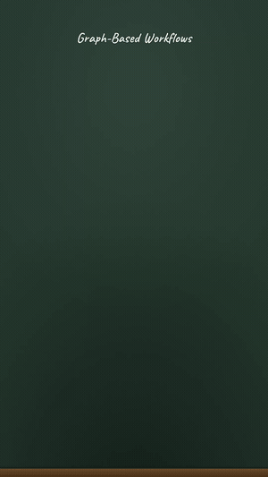
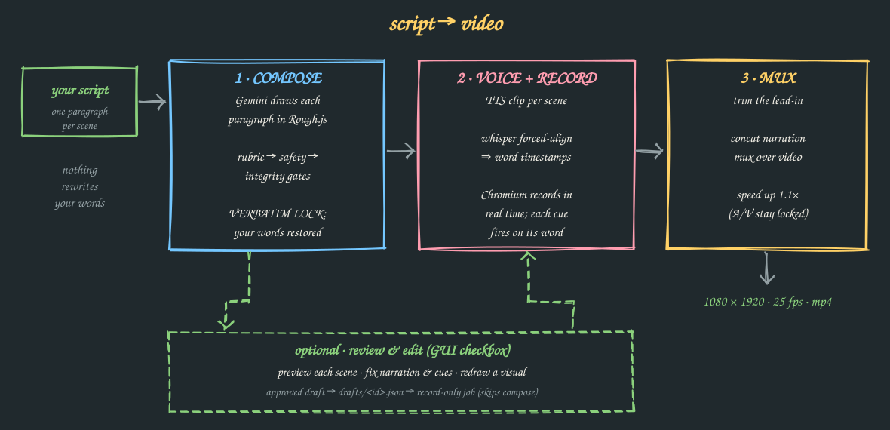
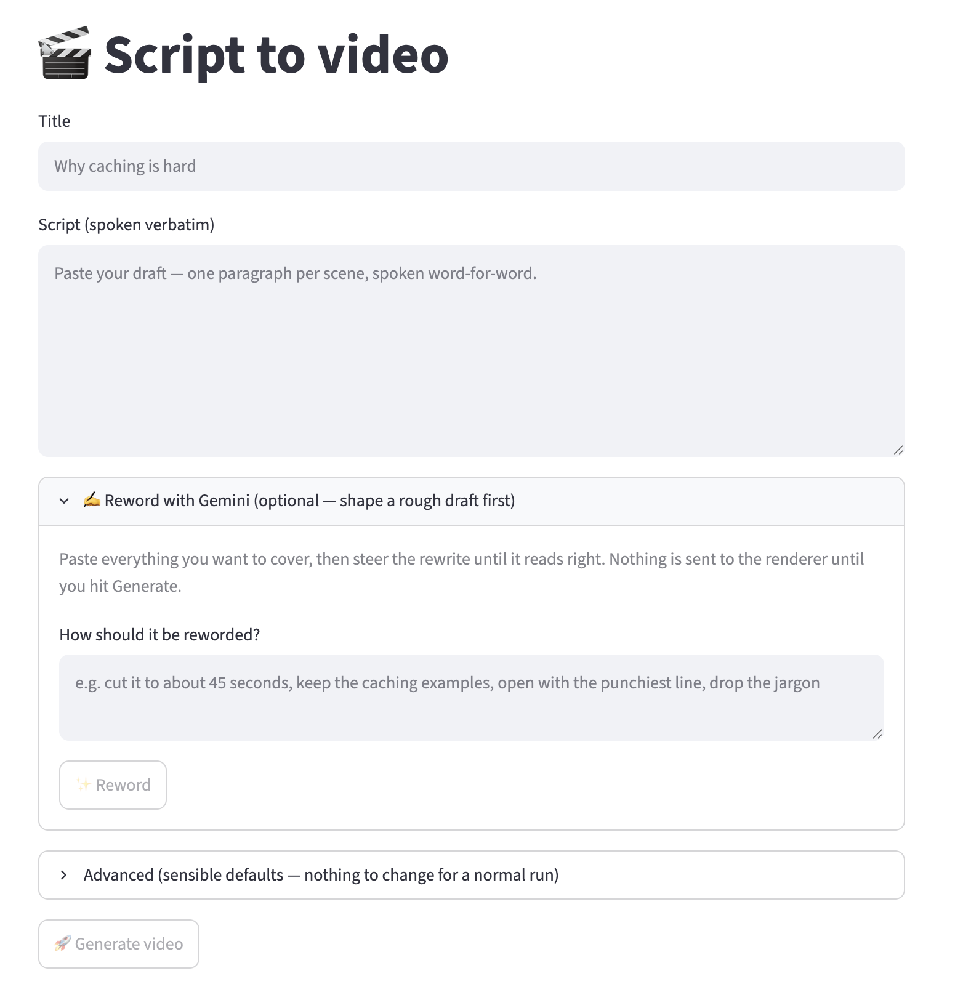
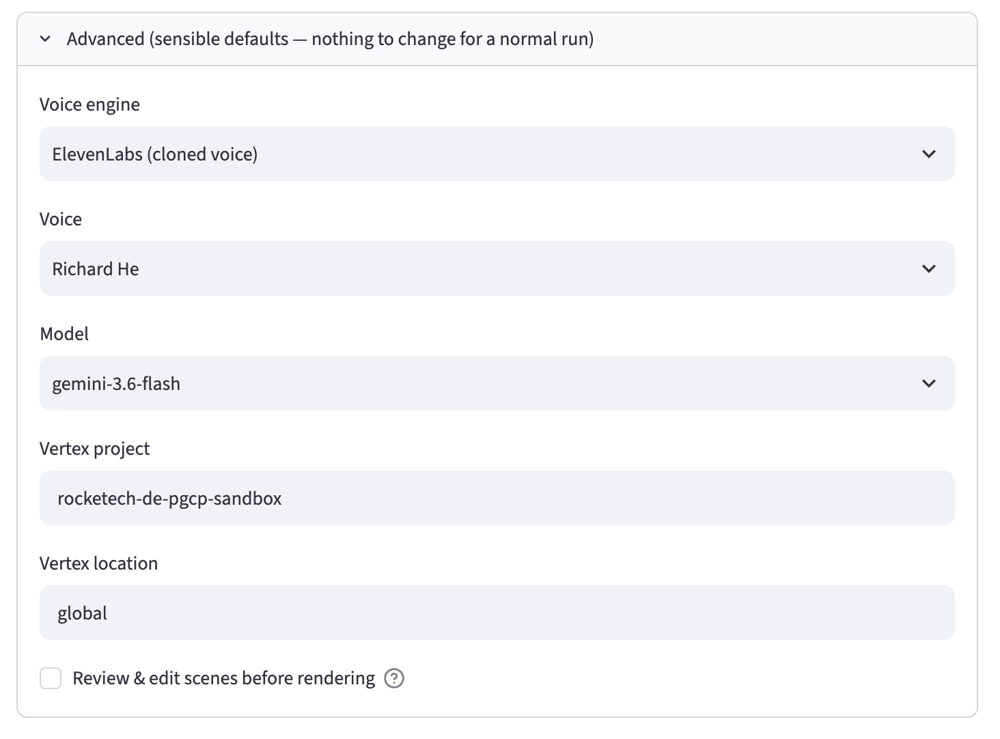
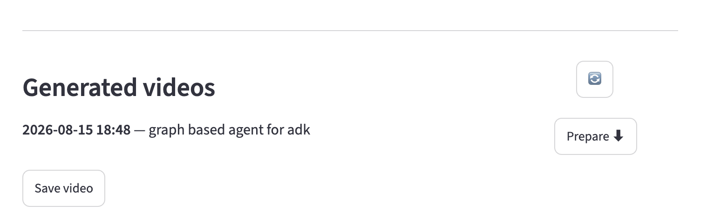
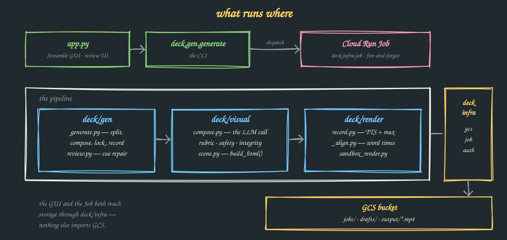
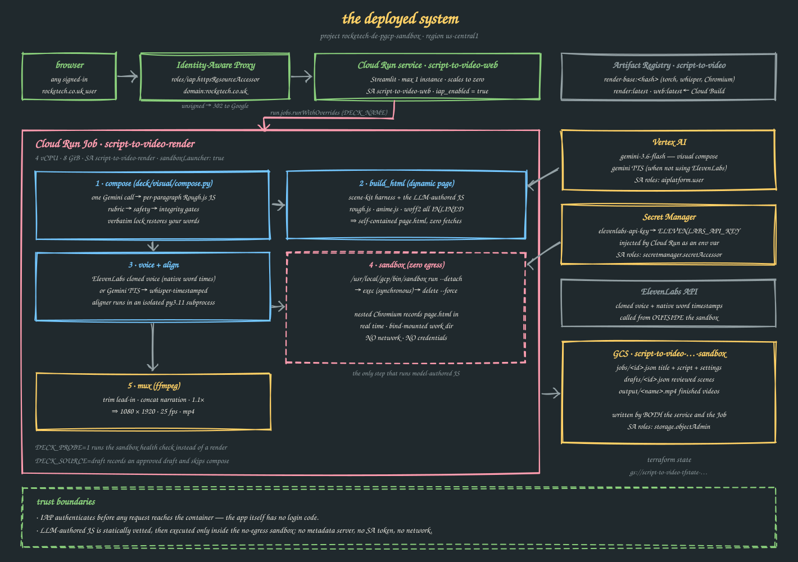

# Script to Video Generator 🎬

Give it your script; get back a 9:16 hand-drawn "chalkboard" video with a
voiceover. Your words are narrated **verbatim** — nothing rewrites, shortens, or
fact-checks them. The LLM's only job is to *draw*: it authors bespoke Rough.js
visualization code per paragraph, which is statically safety-vetted before it
ever runs, and every element is pinned to a spoken cue phrase so the drawing
stays locked to the voice.

Here's a real one — a script about graph-based agents for ADK, start to finish:

[](https://github.com/richardhe-fundamenta/practical-gcp-examples/raw/main/script-to-video-generator/docs/example-graph-agent.mp4)

*First 10 seconds, silent loop — [play the full 94s with audio](https://github.com/richardhe-fundamenta/practical-gcp-examples/raw/main/script-to-video-generator/docs/example-graph-agent.mp4).*



---

## Quick start

**Prerequisites:** Python 3.13+, [uv](https://docs.astral.sh/uv/), `ffmpeg`, and
Google Cloud auth (`gcloud auth application-default login`).

```bash
uv sync
uv run playwright install --with-deps chromium   # one-time: browser for recording
```

### CLI

```bash
# Offline smoke test — no cloud, no ffmpeg (a sample script ships in examples/).
# Writes output/deck.html so you can open the scenes in a browser:
uv run python -m deck.gen.generate "Why caching is hard" \
    --script examples/talk.txt --mock --html-only

# The real thing:
uv run python -m deck.gen.generate "Why caching is hard" \
    --script talk.txt \
    --out output/caching.mp4
```

The script file is plain text: **one blank-line-separated paragraph per scene**.
Each paragraph is spoken as one run and gets its own visual, so your paragraph
breaks are your scene breaks.

Flags: `--script path.txt` (required), `--out`, `--voice Leda`,
`--tts gemini|elevenlabs`, `--eleven-voice-id`, `--project-id`, `--model`.
`--mock` skips the LLM compose (placeholder visuals); `--html-only` stops before
TTS and recording. A plain `--mock` run still records, so it needs TTS creds and
`ffmpeg` — pair it with `--html-only` for a genuinely offline check.

### Web UI

```bash
uv run streamlit run app.py
```

Enter a **Title**, paste your **Script**, hit **Generate** — the render runs in
the background on a Cloud Run Job.



**Advanced** holds the voice engine, voice, model, and Vertex settings — defaults
are fine for a normal run.



Finished renders show up under **Generated videos**, newest-first.



Since the script is spoken verbatim, a rough draft rarely fits as-is. Open
**✍️ Reword with Gemini**, paste everything you want to cover, and steer the
rewrite in plain English ("cut it to 45 seconds", "open with the punchiest
line"). Each reword re-runs from your *original* draft, so changing the steer
re-steers rather than drifting further from what you wrote; **↩︎ Back to my
draft** restores it. Nothing reaches the renderer until you hit Generate. Tick **Review & edit scenes before rendering**
to preview each scene, fix cues, and redraw a visual first. **Generated videos**
lists finished renders from GCS, newest-first.

### Tests

```bash
uv run pytest          # fully offline / mocked; no cloud, no API cost
```

---

## Architecture



### Deployed system

For the GCP-level view — who authenticates, which identity runs what, where each
secret and artifact lives, and how the page is built at render time:



All three diagrams are generated by `node docs/diagrams.js` using the same
vendored Rough.js the videos are drawn with — edit that file, re-run it, commit
the SVGs. Output is seeded, so regenerating an unchanged diagram is a no-op diff.

### The three gates

The LLM writes JavaScript, so nothing it writes is trusted. Between compose and
recording, three deterministic passes run — all *before* the slow, expensive
TTS/record stage:

| Gate | What it does |
|---|---|
| **rubric** (`deck/visual/rubric.py`) | Scores the composed JSON for known failure modes — over-dense steps, duplicate labels, cues that aren't verbatim substrings, cues bunched at the end. On failure it hands the model back its own JSON plus the exact problem list, up to 2 repair rounds. |
| **safety** (`deck/visual/safety.py`) | Statically vets the model-written JS — never executes it — and blanks anything reaching for the network, storage, DOM, or `eval`, keeping its reveal group so voice-sync survives. |
| **integrity** (`deck/visual/integrity.py`) | Repairs sloppy-but-safe code: broken string literals, exact-duplicate draws, anything still unparseable. |

Then the **verbatim lock**: whatever the model echoed back as narration is
discarded and your original paragraph is force-restored, in order, with every cue
snapped back to a real substring of it.

### Why the voice sync is accurate

Fixed per-slide delays drift — TTS durations vary and machine load shifts timing.
Reveals are aligned to the **actual spoken audio** instead:

- **Forced alignment.** Each TTS clip runs through `whisper-timestamped` for
  word-level start times. Its torch stack has no wheels for Python 3.13, so the
  aligner runs in an isolated 3.11 subprocess, pre-warmed at image-build time.
- **Cue phrases.** Each on-screen element carries a short cue — an exact
  substring of its paragraph. `_resolve_reveal_times` finds it in the transcript
  and pins the reveal to that word's start time.
- **Overlap-scored matching.** ASR writes numbers differently than you do
  ("1 MB" → "one megabyte"). `_find_seq` scores candidate windows positionally and
  rejects weak matches rather than latching onto an unrelated token — a bad cue
  degrades to interpolation instead of dragging every reveal off.
- **Absolute deadlines.** Reveals schedule against a fixed monotonic clock, not
  relative sleeps, so drift stays under ~30 ms across a whole video.

A broken aligner degrades timing to even spacing — it never blocks a render.

---

## Cloud Run rendering

Submitting from the GUI is fire-and-forget: it picks a timestamped name, uploads
the payload to `jobs/<id>.json`, triggers one Cloud Run Job execution (with
`DECK_NAME` in the container env), and returns. The Job runs
`python -m deck.infra.job` and uploads the mp4 to `output/`.

Output names are `<YYYYMMDD-HHMMSS>-<title-slug>-<rand>.mp4`, so a descending
name-sort is newest-first.

| Variable | Purpose |
|----------|---------|
| `GCS_BUCKET` | Bucket for payloads and outputs |
| `INFRA_PROJECT` | Project hosting the bucket + Cloud Run Job |
| `REGION` | Region of the bucket and Job |
| `DECK_JOB_NAME` | Cloud Run Job name to trigger |

### Access control

The web service sits behind **Identity-Aware Proxy**. There is no login code in
the app: IAP authenticates every request before it reaches the container, and
only principals holding `roles/iap.httpsResourceAccessor` get through. Terraform
grants that to `domain:<iap_domain>` (default `rocketech.co.uk`), so anyone with
a Workspace account in the domain can sign in, and removing someone from
Workspace removes their access here.

To allow a single outside account instead, add a member to
`google_iap_web_cloud_run_service_iam_member` with `user:someone@example.com`.

### Infrastructure (Terraform)

Everything in `terraform/` is variable-driven: bucket, Artifact Registry repo, a
least-privilege render service account, the image builds, the Cloud Run Job, and
the Streamlit service.

```bash
# One-time: create the Terraform state bucket (the backend can't create itself)
gcloud storage buckets create gs://<STATE_BUCKET> --project <INFRA_PROJECT> --location <REGION>

cd terraform
cp terraform.tfvars.example terraform.tfvars   # set project, bucket, region
terraform init -backend-config="bucket=<STATE_BUCKET>"
terraform apply
```

The heavy **base** image (`Dockerfile.base`) rebuilds only when
`pyproject.toml`/`uv.lock` change. The thin **app** image (`build/Dockerfile`)
rebuilds on `deck/` edits — fast, since it just layers `COPY deck` onto the base.
